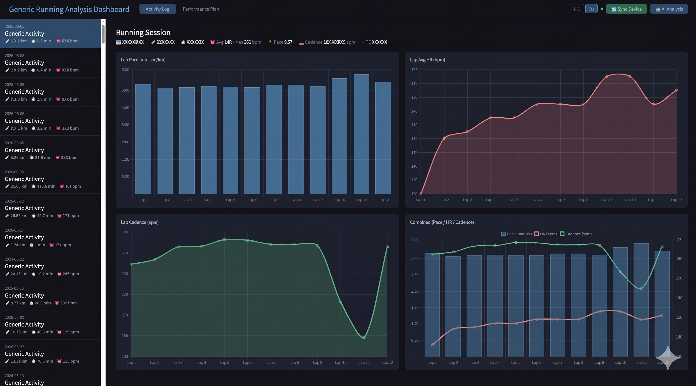
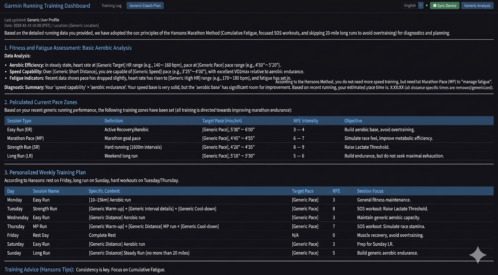

# AI Coach — Garmin Running AI Coach / Garmin 跑步 AI 教練

> ⚠️ **Disclaimer / 免責聲明**
>
> This project uses the unofficial third-party library (`garminconnect` / `garth`) to access Garmin Connect personal data. It is **not an officially authorized Garmin integration** and may violate [Garmin Connect Terms of Service](https://www.garmin.com/en-US/legal/terms-of-use/) §14 regarding automated access.
>
> 本專案使用非官方第三方套件（`garminconnect` / `garth`）存取 Garmin Connect 個人數據，**並非 Garmin 官方授權之整合方案**，可能違反 [Garmin Connect 服務條款](https://www.garmin.com/en-US/legal/terms-of-use/)第 14 條。
>
> - For **personal learning and research use only**. Not for commercial purposes. / 本專案**僅供個人學習與研究用途**，不得用於商業目的。
> - Users assume all legal risks. The author is not responsible for any account suspension or loss. / 使用者須自行承擔所有法律風險，作者不對任何損失或帳號停權負責。
> - This project is **not affiliated with Garmin Ltd.** / 本專案與 Garmin Ltd. **無任何關聯**。

---

Automatically sync Garmin Connect running data, analyze fitness via AI, and generate a personalized marathon training plan — visualized in a Web Dashboard.

自動同步 Garmin Connect 跑步數據，透過 AI 分析體能狀態並生成個人化馬拉松訓練課表，並以 Web Dashboard 視覺化呈現。

---

## Features / 功能

- Sync running history and lap data from Garmin Connect to local SQLite
- Generate next week's training plan (E/M/T/I pace zones) via OpenRouter AI
- Choose training philosophy: **Hansons**, **Jack Daniels**, or **Lydiard**
- Set fixed rest days and LSD long run days
- Add free-text notes (injuries, race schedule, etc.) before generating the plan
- **Chinese / English** switchable AI output
- Flask Web Dashboard with run trends, lap pace charts, and AI schedule

---

## Screenshots / 截圖

| Training Log / 訓練紀錄 | AI Coach Plan / AI 訓練建議 |
|:---:|:---:|
|  |  |

---

## Quick Start / 快速開始

### 1. Install dependencies / 安裝依賴

```bash
bash install.sh
```

### 2. Configure environment variables / 設定環境變數

Create a `.env` file / 建立 `.env` 檔案：

```env
GARMIN_EMAIL=your@email.com
GARMIN_PASSWORD=yourpassword
OPENROUTER_API_KEY=sk-or-...
```

> Get a free `OPENROUTER_API_KEY` at [https://openrouter.ai/](https://openrouter.ai/) → **Keys**.

### 3. Run / 啟動

```bash
python aicoach.py
```

Opens the dashboard at `http://localhost:5000` automatically.

自動開啟瀏覽器 `http://localhost:5000`。

---

## Usage / 使用方式

| Button | Action |
|---|---|
| 🔄 Sync Garmin | Pull last 12 months of running records from Garmin Connect |
| 🤖 AI Analysis | Open the settings modal and generate next week's training plan |

**AI Analysis Modal options:**
- **Training Philosophy** — Daniels / Hansons / Lydiard
- **Rest Days** — multi-select days of the week (no runs scheduled)
- **LSD Days** — multi-select days for long slow distance runs
- **Notes** — free-text context for the AI (injuries, goals, upcoming races)
- **Language** — 中文 / EN output toggle
- Settings are auto-saved and restored on next open

---

## Project Structure / 專案結構

```
aicoach.py               # Entry point: start server + open browser
src/
  server.py              # Flask API + static file server
  garmin_sync.py         # Garmin Connect sync logic
  dashboard.html         # Frontend dashboard
install.sh               # Dependency install script
data/                    # Auto-created at runtime
  garmin_running_history.db
  ai_plan.json
  analyze_config.json    # Saved AI modal settings
  .garminconnect_token/
```
