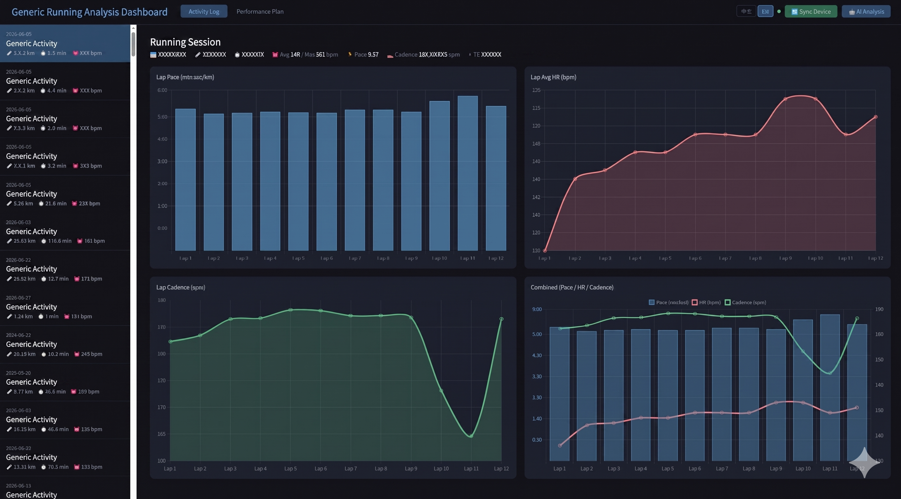
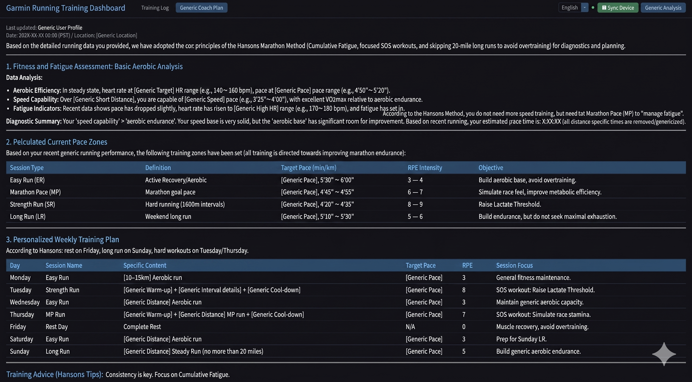

# Un-official Garmin Running AI Coach

[中文說明](README_CH.md)

> ⚠️ **Disclaimer — please read before use**
>
> This is an **unofficial, independent, hobby project**. It is **NOT** created, endorsed, sponsored by, affiliated with, or associated with Garmin Ltd. or any of its subsidiaries in any way.
>
> "Garmin" and "Garmin Connect" are trademarks of Garmin Ltd., used here only descriptively to indicate compatibility. No ownership of these marks is claimed.
>
> - This project accesses Garmin Connect account data through **unofficial third-party libraries** (`garminconnect` / `garth`), **not** through any official or authorized Garmin API. Such automated access **may violate** the [Garmin Connect Terms of Service](https://www.garmin.com/en-US/legal/terms-of-use/) (e.g. provisions on automated access) and could result in account suspension or termination.
> - Provided **"AS IS", without any warranty** of any kind, express or implied. The authors and contributors accept **no liability** for any damages, data loss, account suspension, or other consequences arising from its use, to the maximum extent permitted by law.
> - For **personal, educational and research use only**. **Not for commercial use.**
> - **You use this software entirely at your own risk** and are solely responsible for ensuring your use complies with Garmin's Terms of Service and all applicable laws.
> - The AI-generated training plans are **not professional medical, health, or coaching advice**. Consult a qualified professional before changing your training. Use of any plan is at your own risk.

---

Un-official Garmin Running AI Coach is an independent tool that syncs your running data from a Garmin Connect account (via unofficial libraries), analyzes it with AI, and generates a personalized marathon training plan — visualized in a local Web Dashboard.

---

## Features

- Sync running history and lap data from a Garmin Connect account to a local SQLite database
- Generate next week's training plan (Easy / Marathon Pace / Tempo / Interval zones) via OpenRouter AI
- Choose a training approach: **Jack Daniels**, **Hansons**, **Lydiard**, or **Auto**
  - **Auto** builds a plan around your *own* existing training framework (habitual easy/long distances, weekly mileage, quality-session frequency, personal HR zones) rather than imposing a fixed methodology
- Target race inputs: race **date**, **type** (5K / 10K / Half / Full) and **goal finish time** (HH:MM:SS); pace is calibrated to the goal and the plan is periodized toward the race date (including a pre-race taper when close to race day)
- Set history lookback period for analysis (1, 3, 6, 12 months)
- Set fixed rest days and LSD long-run days
- Add free-text notes (injuries, race schedule, etc.) before generating the plan
- **Chinese / English** switchable AI output and progress messages
- Automatic retry with multiple free-model fallback for the AI call
- Flask Web Dashboard with run trends, lap pace charts, and the AI schedule

---

## Screenshots

| Training Log | AI Coach Plan |
|:---:|:---:|
|  |  |

---

## Quick Start

### 1. Install dependencies

```bash
bash install.sh
```

### 2. Configure environment variables

Create a `.env` file:

```env
GARMIN_EMAIL=your@email.com
GARMIN_PASSWORD=yourpassword
OPENROUTER_API_KEY=sk-or-...
```

> Get a free `OPENROUTER_API_KEY` at [https://openrouter.ai/](https://openrouter.ai/) → **Keys**.

### 3. Run

```bash
python aicoach.py
```

Opens the dashboard at `http://localhost:5000` automatically.

---

## Usage

| Button | Action |
|---|---|
| 🔄 Sync Garmin | Pull last 12 months of running records from Garmin Connect |
| 🤖 AI Analysis | Open the settings modal and generate next week's training plan |

**AI Analysis Modal options:**
- **Training Approach** — Auto / Jack Daniels / Hansons / Lydiard (Auto adapts to your own training framework)
- **Target Race** — race date, type (5K / 10K / Half / Full) and goal finish time (HH:MM:SS)
- **History Lookback** — choose how many months of past data the AI should analyze
- **Rest Days** — multi-select days of the week (no runs scheduled)
- **LSD Days** — multi-select days for long slow distance runs
- **Notes** — free-text context for the AI (injuries, goals, upcoming races)
- **Language** — 中文 / EN output toggle
- Settings are auto-saved and restored on next open

---

## Project Structure

```
aicoach.py               # Entry point: start server + open browser
src/
  server.py              # Flask API + static file server
  garmin_sync.py         # Garmin Connect sync logic
  dashboard.html         # Frontend dashboard
install.sh               # Dependency install script
data/                    # Auto-created at runtime
  garmin_running_history.db
  ai_plan.json
  analyze_config.json    # Saved AI modal settings
  .garminconnect_token/
```
