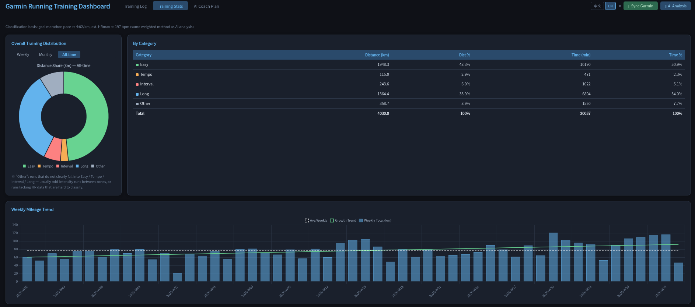

# Un-official Garmin Running AI Coach（非官方 Garmin 跑步 AI 教練）

[English Version](README.md)

> ⚠️ **免責聲明 — 使用前請詳閱**
>
> 本專案為**非官方、獨立的業餘開發專案**，與 Garmin Ltd. 及其任何子公司**均無任何關聯**，亦**未經其建立、認可、贊助或授權**。
>
> 「Garmin」與「Garmin Connect」為 Garmin Ltd. 之商標，本文件僅為「說明相容性」而描述性地提及，不主張對該等商標之任何權利。
>
> - 本專案透過**非官方第三方套件**（`garminconnect` / `garth`）存取 Garmin Connect 帳號數據，**並非**透過任何官方或授權之 Garmin API。此類自動化存取**可能違反** [Garmin Connect 服務條款](https://www.garmin.com/en-US/legal/terms-of-use/)（例如關於自動化存取之規定），並可能導致帳號遭停權或終止。
> - 本軟體以**「現狀」（AS IS）提供，不附帶任何明示或默示之擔保**。於法律允許之最大範圍內，作者與貢獻者對因使用本軟體所生之任何損害、資料遺失、帳號停權或其他後果，**概不負責**。
> - **僅供個人、教育與研究用途**，**不得用於商業目的**。
> - **您須自行承擔使用本軟體之全部風險**，並自行負責確保您的使用符合 Garmin 服務條款及所有適用法律。
> - AI 生成之訓練課表**並非專業醫療、健康或教練建議**。變更訓練內容前請諮詢合格的專業人士，任何課表之採用風險由您自行承擔。

---

Un-official Garmin Running AI Coach 是一款獨立工具，透過非官方套件從 Garmin Connect 帳號同步跑步數據，以 AI 分析後生成個人化的馬拉松訓練課表，並以本機 Web Dashboard 視覺化呈現。

---

## 功能

- 從 Garmin Connect 帳號同步跑步歷史與圈數數據到本機 SQLite 資料庫
- 透過 OpenRouter AI 生成下週訓練課表（輕鬆跑 / 馬拉松配速 / 節奏跑 / 間歇 區間）
- 選擇訓練取向：**Jack Daniels**、**Hansons**、**Lydiard** 或 **Auto**
  - **Auto** 不套用固定流派，而是依你*自身*既有的訓練框架（慣用的輕鬆跑/長跑距離、週里程、質量課頻率、個人心率區間）來規劃
- 目標賽事輸入：賽事**日期**、**類型**（5K / 10K / 半馬 / 全馬）與**目標完賽時間**（HH:MM:SS）；配速依目標校準，並朝賽事日期做週期化編排（接近賽事時含賽前減量）
- 設定歷史紀錄參考範圍（1、3、6、12 個月）
- 設定固定休息日與 LSD 長跑日
- 在生成課表前加入文字備註（傷痛情況、賽事安排等）
- 支援 **中文 / 英文** 切換的 AI 輸出與進度訊息
- AI 呼叫具備自動重試與多個免費模型備援
- 提供 Flask Web Dashboard，包含跑步趨勢、單圈配速圖表與 AI 訓練課表
- **訓練統計**分頁：以與 AI 分析相同的加權分類法，呈現輕鬆跑 / 節奏跑 / 間歇跑 / 長跑在「週 / 月 / 全期間」的跑量、時間與比例——包含訓練分布圓餅圖、各類別統計表格，以及含平均線與成長趨勢線的每週跑量趨勢圖
- **單次 AI 跑力分析**：在訓練紀錄點選某一筆、按「AI 跑力分析」，即可對該次訓練做客觀評估（課的性質與強度、配速與心率的效率、分圈配速穩定度、VDOT／跑力推估與具體建議），並以你近 30 天的各類型基準作為比較參照；分析結果會快取於資料庫

---

## 截圖

| 訓練紀錄 | AI 訓練建議 |
|:---:|:---:|
|  |  |

### 訓練統計

以「週 / 月 / 全期間」呈現各類型跑步的分布，並附帶含平均線與成長趨勢線的每週跑量趨勢圖。



---

## 快速開始

### Windows 使用者（懶人包 Easy Setup）

> 👉 **想最快上手？** 請直接看這份一步一步的圖文懶人包：
> **[`windows/Windows使用說明.md`](windows/Windows使用說明.md)**（含如何免費取得 OpenRouter API Key）。
> 下面只是摘要。

開始前需要準備：① Garmin Connect 帳號密碼　② 一組免費的 **OpenRouter API Key**
（在 <https://openrouter.ai/keys> 用 Google 登入 → Create Key → 複製 `sk-or-...`，約 2 分鐘）。

有兩種使用方式：

**方式 A — 免安裝 exe 版（最簡單，不需裝 Python）：** 在一台裝有 Python 的 Windows 上
執行一次 `windows\build.bat` 產生 `dist\AiCoach.exe`；把 exe 連同填好的 `.env` 放在同一個目錄，
雙擊 exe 即可執行。

**方式 B — Python 版：** 全程只要「雙擊」幾個 `.bat` 檔：

1. 安裝 [Python](https://www.python.org/downloads/) — 安裝時務必勾選 **「Add Python to PATH」**。
2. 打開 **`windows`** 資料夾，依序雙擊：
   - **`install.bat`** — 安裝所需的 Python 套件（只需一次）。
   - **`設定帳號.bat`** — 輸入你的 Garmin 帳號/密碼與 OpenRouter API Key，會自動幫你建立 `.env`（只需一次）。
   - **`start.bat`** — 啟動程式，瀏覽器會自動開啟 `http://localhost:5000`。

> 使用期間請勿關閉那個黑色視窗，關掉它等於關閉程式。

### Linux / macOS 使用者

#### 1. 安裝依賴

```bash
bash install.sh
```

#### 2. 設定環境變數

建立 `.env` 檔案：

```env
GARMIN_EMAIL=your@email.com
GARMIN_PASSWORD=yourpassword
OPENROUTER_API_KEY=sk-or-...
```

> 請至 [https://openrouter.ai/](https://openrouter.ai/) 的 **Keys** 頁面獲取免費的 `OPENROUTER_API_KEY`。

#### 3. 啟動

```bash
python aicoach.py
```

程式會自動開啟瀏覽器並導向 `http://localhost:5000`。

---

## 使用方式

| 按鈕 | 動作 |
|---|---|
| 🔄 同步 Garmin | 從 Garmin Connect 抓取過去 12 個月的跑步紀錄 |
| 🤖 AI 分析 | 開啟設定視窗並生成下週訓練計畫 |

**AI 分析設定選項：**
- **訓練取向 (Training Approach)** — Auto / Jack Daniels / Hansons / Lydiard（Auto 會依你自身的訓練框架調整）
- **目標賽事 (Target Race)** — 賽事日期、類型（5K / 10K / 半馬 / 全馬）與目標完賽時間（HH:MM:SS）
- **歷史紀錄參考範圍 (History Lookback)** — 選擇要參考過去幾個月的數據進行分析
- **休息日 (Rest Days)** — 複選每週不安排跑步的日子
- **LSD 日 (LSD Days)** — 複選安排長距離慢跑的日子
- **備註 (Notes)** — 提供給 AI 的額外背景資訊（傷痛、目標、近期賽事）
- **語言 (Language)** — 中文 / 英文 輸出切換
- 設定會自動儲存，下次開啟時會自動帶入

---

## 專案結構

```
aicoach.py               # 入口程式：啟動伺服器並開啟瀏覽器
src/
  server.py              # Flask API 與靜態檔案伺服器
  classifier.py          # 跑步分類與訓練框架分析
  prompts.py             # 術語、教練流派規則、術語正規化
  ai_client.py           # OpenRouter 呼叫（含重試與多模型備援）
  dashboard.html         # 前端儀表板
tests/                   # pytest 單元測試（分類 / prompts / ai_client / 統計）
install.sh               # 依賴安裝腳本（Linux / macOS）
aicoach.spec             # PyInstaller 設定（打包單一 Windows exe 用）
VERSION                  # 版號唯一來源
bump_version.py          # 更新版號（patch/minor/major，可選打 git tag）
windows/                 # Windows 使用者的一鍵啟動包
  install.bat            # 安裝 Python 依賴套件
  設定帳號.bat           # 設定帳號 → 自動建立 .env
  start.bat              # 啟動程式
  build.bat              # 打包成單一 AiCoach.exe（打包者用）
  Windows使用說明.md     # 圖文使用教學
data/                    # 執行時自動建立
  garmin_running_history.db
  ai_plan.json
  analyze_config.json    # 儲存的 AI 設定
  .garminconnect_token/
```
